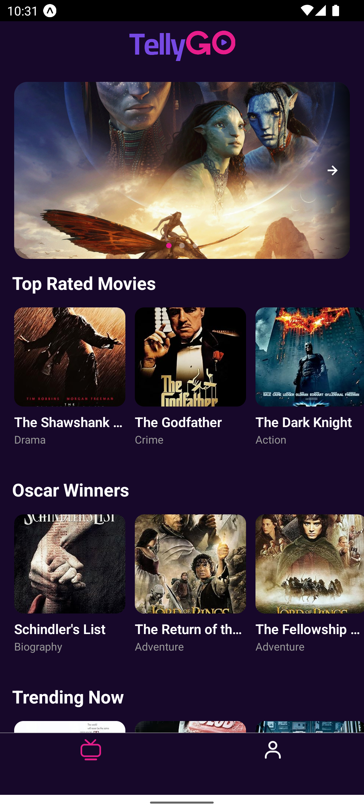
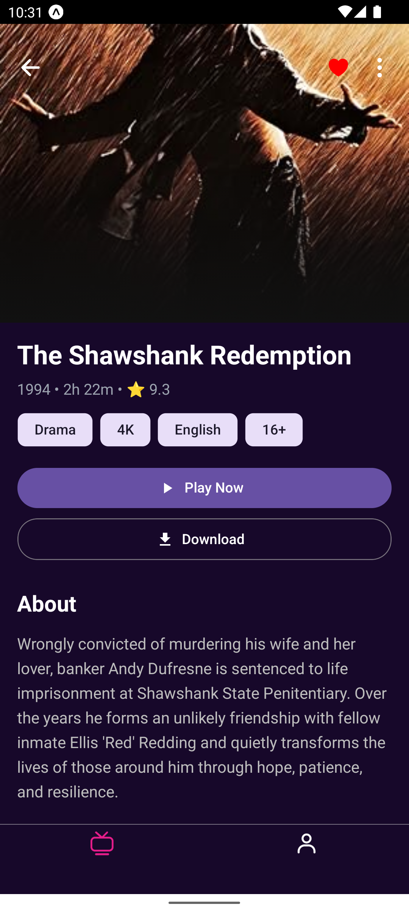
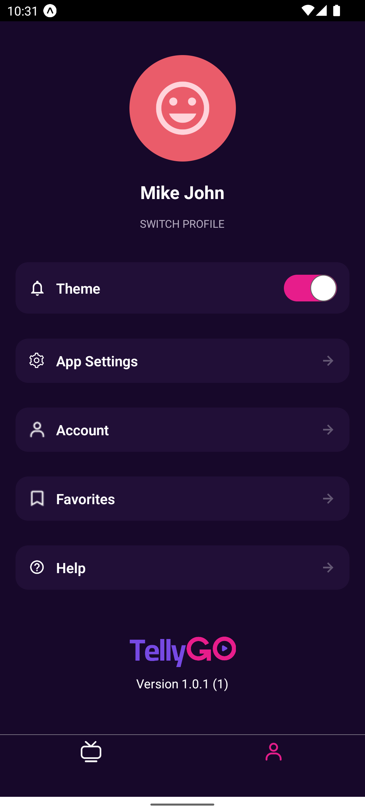

# OTTExpo

A React Native streaming app UI built with Expo for iOS and Android.

## What is this?

OTTExpo is a mobile app that looks like Netflix or Disney+. It shows featured content in a carousel, organized Movies, and a user profile page.

## Features

- **Home Screen** - Banner slider and channel recommendations
- **Profile Screen** - User profile with dark/light theme toggle
- **Theme Support** - Switch between dark and light modes
- **iOS & Android** - Native mobile experience on both platforms

## Tech Stack

- React Native
- Expo
- TypeScript
- NativeWind (Tailwind CSS)
- Zustand (State Management)
- React Native Paper
- React Navigation

## Installation

1. Clone the repo

    ```bash
    git clone <repo-url>
    cd ottexpo
    ```

2. Install dependencies

    ```bash
    npm install
    ```

3. Start the app
    ```bash
    npm start
    ```

## Running on Mobile

### Android

Option 1: Using Android Emulator

```bash
npm run android
```

Option 2: Using Expo Go

- Install Expo Go from Google Play
- Run `npm start`
- Scan QR code with Expo Go app

### iOS

Option 1: Using iOS Simulator

```bash
npm run ios
```

Option 2: Using Expo Go

- Install Expo Go from App Store
- Run `npm start`
- Scan QR code with Expo Go app

## Project Structure

```
ottexpo/
├── src/
│   ├── screens/         # App pages (Home, Profile)
│   ├── components/      # Reusable UI components
│   ├── navigation/      # App navigation setup
│   ├── theme/           # Colors and design tokens,
│   ├──assets/           # Images and icons
│   ├── store/           # App state (Zustand)
│   └── services/        # API calls
└── App.tsx              # Main app file
```

## Screenshots

### Home Screen



### Detail Screen



### Profile Screen



## Available Scripts

```bash
npm start              # Start development server
npm run android        # Run on Android emulator
npm run ios           # Run on iOS simulator
npm run lint          # Check code quality
npm run reset-project # Reset to initial state
```

## Screenshots

### Home Screen


**Features shown:**

- TellyGO app branding
- Banner carousel with featured content
- Top Rated Movies section with 3 movie cards
- Oscar Winners section with 3 movie cards
- Trending Now section
- Bottom tab navigation (Home & Profile)

## Environment Setup

No special setup required. The app uses mock data by default.

## Build for Production

### Android Build

```bash
eas build --platform android
```

### iOS Build

```bash
eas build --platform ios
```

## Requirements

- Node.js (v16 or higher)
- npm or yarn
- Android Studio (for Android development)
- Xcode (for iOS development)
- Expo CLI (optional)

## License

MIT License - See LICENSE file for details

## Support

For issues or questions, please create an issue in the repository.

---

Made with React Native & Expo ❤️
